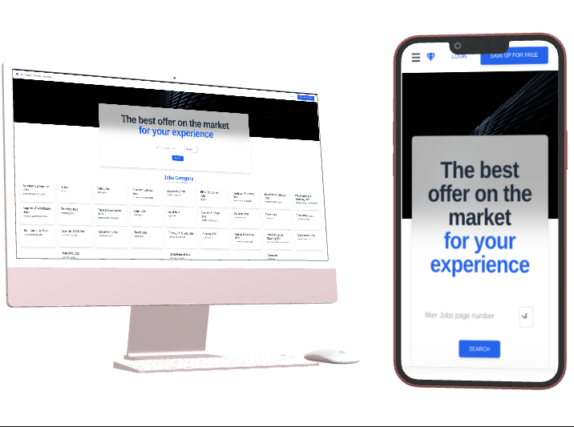

# Job-Board-capstone-III

> This is an Educational Project for the Microverse Module 3 (React-Redux) capstone. It is built with React, Redux/Toolkit, TailwindCSS, Tailwind Elements and React Linters for enforcing standard coding react coding practice. The Project is aimed at fetching API data, displaying same and query the API endpoints for searched data for Job listings in different countries in Europe and also in South Africa. This project is MIT Licensed

## Built With

- JavaScript
- ReactJs, tailwindCSS
- Git, GitHub, Git workflow, Jest

## Deployments

> [Netlify Deplyment](https://elegant-selkie-f91b3f.netlify.app/)

## Mockup 

> Multi devices

## Getting Started

### To have a copy of this project running on your local machine, follow these commands:

- Clone this repo to your local machine
  -  `git clone git@github.com:traveler-hub/job-board-capstone-III
`
  - Open the folder "job-board-capstone-III
 and run `npm install` to install all necesary scripts,
  - Run from your termminal, `npm start` to open the project in your browser.

**This project was bootstrapped with [Create React App](https://github.com/facebook/create-react-app).**

To get a local copy up and running follow these simple example steps.

### Prerequisites

- [NodeJS](https://nodejs.org/en/docs/)

> As an asynchronous event-driven JavaScript runtime, Node.js is designed to build scalable network applications. In the following "hello world" example, many connections can be handled concurrently. Upon each connection, the callback is fired, but if there is no work to be done, Node.js will sleep.

- [Text Editor(VScode Recommended)](https://code.visualstudio.com/)

> Visual Studio Code is a free coding editor that helps you start coding quickly. Use it to code in any programming language, without switching editors.

### Setup

**Run from your terminal:**

- `npx create-react-app ./`

**cd into space-traveler-hub folder, then run from your terminal:**

- `npm start`

### Usage

**When the above commands aresuccessfully run, your browser should open on `localhost:3000`, if not, open your browser and load `127.0.0.1:3000` to see your default template loaded**

### Run tests

> coming soon :smile:

### Deployment

> coming soon :smile:

## Authors

👤 **Makoji David**

- GitHub: [@aceDavon](https://github.com/aceDavon)
- Twitter: [@sharkleshevon](https://twitter.com/sharkleshevon)
- LinkedIn: [Makoji David](https://www.linkedin.com/in/makoji-david/)

## 🤝 Contributing

Contributions, issues, and feature requests are welcome!

Feel free to check the [issues page](../../issues/).

## Show your support

Give a ⭐️ if you like this project!

## Acknowledgments

- Hat tip to anyone whose code was used
- Inspiration
- etc

## 📝 License

This project is [MIT](./MIT.md) licensed.